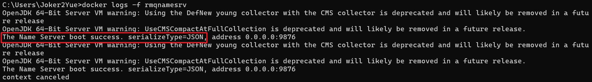
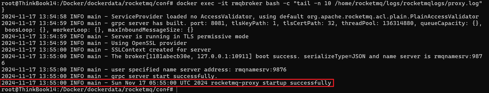
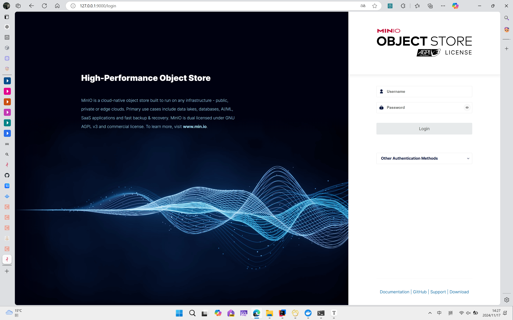

# 部分中间件部署docker命令


说明，为测试所用，所有的中间件都是以单节点模式运行，同时，作者的运行环境为Windows11 24H2 + WLS2(Ubuntu 20.04)，若你的环境与之有出入，也许本文档所述命令也许并不适用于你的环境。


### RocketMQ

---

#### 1.拉取RocketMQ镜像

这里以[dockerhub](https://hub.docker.com/r/apache/rocketmq/tags)上 RocketMQ 5.3.1 版本的镜像为例，介绍部署过程。

```shell
docker pull apache/rocketmq:5.3.1
```

#### 2.创建容器共享网络

RocketMQ 中有多个服务，需要创建多个容器，创建 docker 网络便于容器间相互通信。

```shell
docker network create rocketmq
```

#### 3.启动NameServer

```shell
# 启动 NameServer
docker run -d --name rmqnamesrv -p 9876:9876 --network rocketmq apache/rocketmq:5.3.1 sh mqnamesrv

# 验证 NameServer 是否启动成功
docker logs -f rmqnamesrv
```

我们可以看到 **'The Name Server boot success..'，** 表示NameServer 已成功启动。



#### 4.启动 Broker+Proxy

NameServer 成功启动后，我们启动 Broker 和 Proxy。

由于我这里使用的是Windows+WSL2，不同的环境请合理使用对应的配置方式。

~~~shell
# 配置 Broker 的IP地址
mkdir -p /Docker/dockerdata/rocketmq/conf
cd /Docker/dockerdata/rocketmq/conf
echo "brokerIP1=127.0.0.1" > broker.conf

# 启动 Broker 和 Proxy
docker run -d \
--name rmqbroker \
--network rocketmq \
-p 10912:10912 -p 10911:10911 -p 10909:10909 \
-p 8080:8080 -p 8081:8081 \
-e "NAMESRV_ADDR=rmqnamesrv:9876" \
-v ./broker.conf:/Docker/dockerdata/rocketmq/conf/broker.conf \
apache/rocketmq:5.3.1 sh mqbroker --enable-proxy \
-c /Docker/dockerdata/rocketmq/conf/broker.conf

# 验证 Broker 是否启动成功
docker exec -it rmqbroker bash -c "tail -n 10 /home/rocketmq/logs/rocketmqlogs/proxy.log"
~~~

我们可以看到 **'The broker boot success..'，** 表示 Broker 已成功启动。



至此，一个单节点副本的 RocketMQ 集群已经部署起来了，我们可以利用脚本进行简单的消息收发。


### Redis

---

使用下方命令直接启动redis：

~~~shell
docker run --restart=always -p 6379:6379 --name redis7 -d redis:7.2.5  --requirepass 123456
~~~

将会自动配置重启选项、端口、密码。


### MinIO

---

#### 1.准备目录地址

在这里，我们使用`/Docker/dockerdata/minio/config`作为MinIO的配置文件存放地址，使用` /Docker/dockerdata/minio/data`作为MinIO的数据存放地址。执行下方命令：

~~~shell
 mkdir -p /Docker/dockerdata/minio/config
 mkdir -p /Docker/dockerdata/minio/data
~~~

#### 2.拉取MinIO镜像

~~~shell
docker pull minio/minio:RELEASE.2024-11-07T00-52-20Z
~~~

#### 3.启动MinIO

~~~shell
docker run -d -p 9000:9000 --name minio \
  -d --restart=always \
  -e MINIO_ACCESS_KEY=minio \
  -e MINIO_SECRET_KEY=minio@123 \
  -v /Docker/dockerdata/minio/data:/data \
  -v /Docker/dockerdata/minio/config:/root/.minio \
  minio/minio:RELEASE.2024-11-07T00-52-20Z server /data --console-address ":9000" --address ":9090"
~~~

此步骤将会使用我们自定义的访问密码。

#### 4.查看MinIO

浏览器输入**127.0.0.1:9000**，如果出现如下界面，则MinIO成功启动。



登录时的用户名密码在上一步中已经定义。接下来你可以在MinIO中创建存储桶和AK/SK。
